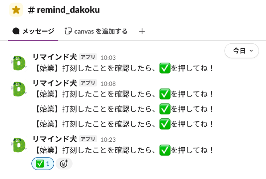

# 打刻リマインド（remind-dakoku）

## 目的

- **打刻漏れ防止**。始業・終業時の打刻忘れを Slack リマインドで解消
- 平日の朝・夜の時間帯に Slack チャンネルへ定期投稿 → 打刻を促す
- 打刻完了後は指定リアクションで当日の時間帯分を停止 → 通知疲れ回避

## 概要

- 平日（土日・日本の祝日を除く）の朝・夜の時間帯（Script Properties で設定、例 10:00-11:00 / 19:00-22:00）、5分おきに指定チャンネル自動投稿
- 投稿に指定リアクション付与 → その時間帯の当日分停止
- 数字のみ投稿（例 `10`）→ 投稿時刻からN分リマインド一時停止（スヌーズ）
- GAS + Slack API で実現

## 使い方

Bot が投稿するリマインドに対して、チャンネル上の操作だけで制御できる。

| 操作 | 効果 |
|------|------|
| 当日の投稿に ✅ リアクション | その時間帯の当日分リマインド停止 |
| 当日の投稿に ❤️ リアクション、 または本文に ❤️ を含むメッセージを投稿 （💛💚💙 等の色違いも可） | 朝・夜 両方の当日リマインド停止（休暇など終日不要な日向け） |
| 本文に ✅ を含むメッセージを投稿 | 当該時間帯のリマインド停止（リマインド開始前に先回りで打刻完了を申告する用途） |
| 数字のみ投稿（例 `10`） | 投稿時刻からN分スヌーズ。期限切れで自動再開 |

## ドキュメント

- [docs/setup.md](docs/setup.md) — 構築手順
- [docs/behavior.md](docs/behavior.md) — 挙動仕様（時刻・曜日ごとの詳細な動作）
- [docs/customize.md](docs/customize.md) — カスタマイズ（時間帯・絵文字・リマインド文言。Script Properties で変更可）
- [docs/architecture.md](docs/architecture.md) — システム構成・設計
- [src/code.gs](src/code.gs) — コード本体
